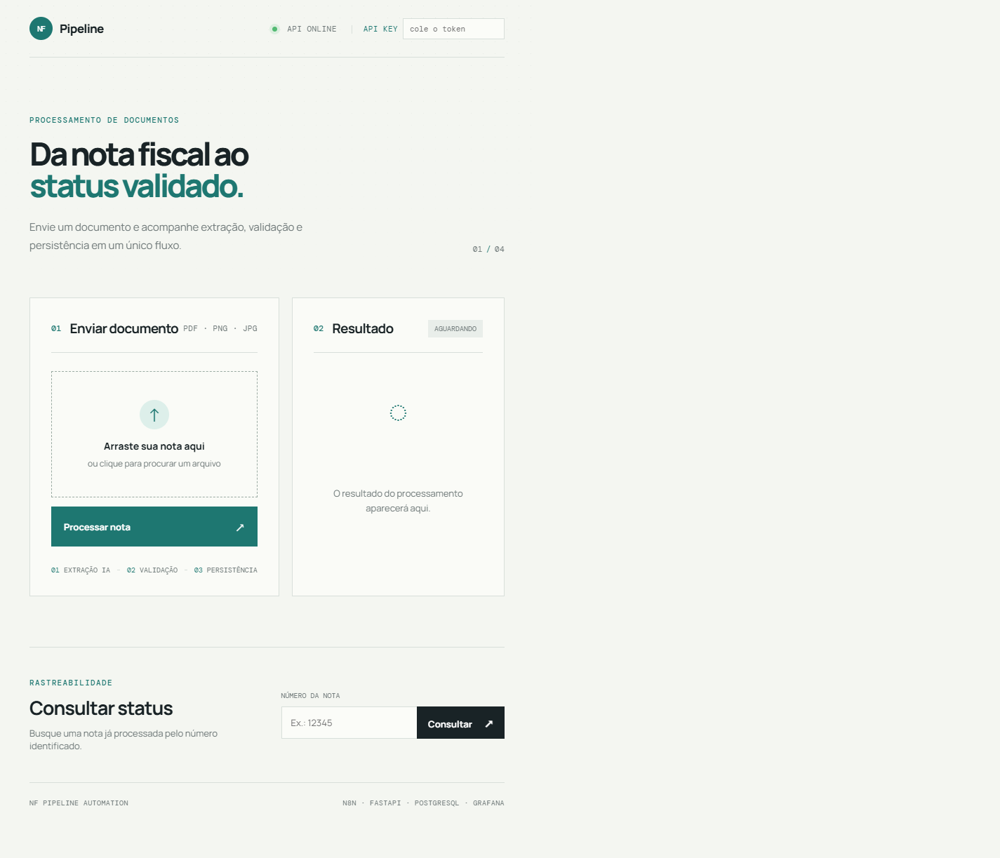

# NF Pipeline Automation

Pipeline de automação para processamento de notas fiscais: recebimento, extração de dados via IA, validação de regras de negócio, persistência em banco, consulta de status e monitoramento operacional.

O projeto também inclui uma interface web em `http://localhost:8000` para demonstrar o pipeline sem depender de comandos: basta enviar uma nota fiscal, acompanhar as etapas e consultar o status de uma nota processada.

## Arquitetura

O **n8n** orquestra o fluxo do início ao fim. O serviço em **Python (FastAPI)** entra como microsserviço de apoio, chamado via HTTP, responsável por duas coisas isoladas de propósito:

- **Extração** (`/extract`): usa a API do Gemini para ler o documento e extrair os campos da nota
- **Validação** (`/validate`): aplica regras de negócio puras (CNPJ, valor, data, duplicidade) — sem depender de IA

Separar extração de validação foi uma decisão deliberada: o provedor de IA pode mudar ou falhar, mas a lógica de negócio não deve depender disso.

```
Webhook → Extrair Dados (IA) → HTTP Request → Validar Regras de Negócio → IF (nota válida?)
                                                                              ├─ true  → Postgres: grava nota aprovada
                                                                              └─ false → Postgres: grava nota rejeitada (com motivo)
                                                                                              ↓
                                                                                    Responde Webhook
```

Cada nota rejeitada é gravada no banco (não apenas notificada por e-mail), com:
- valores de fallback nas colunas obrigatórias quando a IA não consegue extrair um campo (nota inválida/ilegível)
- `numero_nota` único por execução, evitando colisão de constraint quando múltiplas notas inválidas caem no mesmo fallback
- `motivo_rejeicao` preenchido com a razão da rejeição

## Stack

- **n8n** — orquestração do fluxo
- **Python / FastAPI** — extração (Gemini) e validação de regras de negócio
- **Interface web** — upload de nota, acompanhamento das etapas e consulta de status
- **PostgreSQL** — persistência de notas aprovadas e rejeitadas
- **Grafana** — dashboard provisionado automaticamente com métricas de aprovação, rejeição e motivos
- **Docker Compose** — sobe os 4 serviços (n8n, Postgres, extraction_service e Grafana) de uma vez

## Estrutura

```
nf-pipeline-automation/
├── docker-compose.yml
├── .env.example
├── db/
│   └── init.sql                # cria as tabelas automaticamente
├── extraction_service/
│   ├── main.py                 # extração (IA) + validação de regras
│   ├── frontend/               # tela web de upload e status
│   ├── requirements.txt
│   ├── Dockerfile
│   └── tests/test_main.py      # testes automatizados das regras
├── grafana/
│   ├── dashboards/nf-pipeline.json
│   └── provisioning/           # datasource e dashboard automáticos
└── n8n/
    └── workflow.json           # fluxo completo pronto pra importar
```

## Interface de demonstração

A interface web coloca o pipeline em primeiro plano para quem está conhecendo o projeto: o visitante pode enviar uma nota fiscal, acompanhar as etapas de extração, validação e persistência e consultar o status de uma nota já processada, sem precisar começar pelo terminal.



Ela é servida pelo próprio FastAPI em `http://localhost:8000`, reaproveitando o endpoint `/process` do fluxo principal.

## Como rodar

1. Gere uma chave gratuita da API do Gemini em https://aistudio.google.com/app/apikey
2. Copie `.env.example` para `.env`, cole a chave do Gemini e substitua `API_AUTH_TOKEN` por um token forte. Gere um token com:
   ```bash
   python -c "import secrets; print(secrets.token_urlsafe(32))"
   ```
3. Suba os containers:
   ```bash
   docker compose up -d --build
   ```
4. Abra `http://localhost:8000` para usar a interface web de upload e acompanhar o processamento. A captura acima mostra a tela inicial do projeto.
5. Acesse `http://localhost:5678`, importe `n8n/workflow.json` e configure a credencial do Postgres (host `postgres`, database `nf_pipeline`, user `nf_user`)
6. Publique o workflow e teste:
   ```bash
   curl -X POST http://localhost:5678/webhook/nota-fiscal -F "data=@caminho/para/nota.png"
   ```
7. Confira o resultado direto no banco:
   ```bash
   docker compose exec postgres psql -U nf_user -d nf_pipeline -c "SELECT * FROM notas_fiscais ORDER BY id DESC;"
   ```

Também é possível testar a extração e validação isoladamente, sem o n8n:
```bash
curl -X POST http://localhost:8000/process -H "X-API-Key: SEU_API_AUTH_TOKEN" -F "file=@caminho/para/nota.png"
```

### Autenticação da API

Os endpoints de negócio (`/extract`, `/extract-base64`, `/validate`, `/process` e `/notas/{numero_nota}/status`) exigem o header `X-API-Key`. O token é carregado por variável de ambiente e não fica salvo no código, no workflow ou no README. O endpoint `/health` permanece público para probes de disponibilidade.

Os endpoints que podem chamar o Gemini (`/extract`, `/extract-base64` e `/process`) também possuem rate limiting por API key. O padrão é **10 chamadas a cada 60 segundos**; ao exceder o limite, a API responde `429 Too Many Requests` com o header `Retry-After`. Ajuste `RATE_LIMIT_REQUESTS` e `RATE_LIMIT_WINDOW_SECONDS` no `.env` conforme sua cota.

O contador é thread-safe e fica em memória no container do FastAPI, adequado para esta implantação com um serviço. Em uma implantação com múltiplas réplicas, use um armazenamento compartilhado como Redis ou um rate limiter no proxy para manter um limite global.

Na interface web, informe o mesmo token no campo **API key**. Ele fica somente no `sessionStorage` da aba e é enviado automaticamente nas ações de upload e consulta.

O workflow do n8n recebe `API_AUTH_TOKEN` pelo Compose e repassa a chave nos nós que chamam o FastAPI. Ao importar o workflow em outra instalação, configure essa variável no ambiente do n8n.

### Interface web

A tela inicial é servida pelo próprio FastAPI e oferece:

- upload por clique ou arrastar e soltar de PDF e imagens;
- indicação visual das etapas de extração, validação e persistência;
- resultado com status, número, CNPJ, valor e data extraídos;
- feedback de erro ou rejeição com o motivo da regra de negócio;
- consulta de status por número da nota.

Ela usa o endpoint `/process` existente, portanto a demonstração visual percorre exatamente o mesmo pipeline do backend.

### Consulta de status

Depois que uma nota for processada, consulte o status pelo número da nota:

```bash
curl http://localhost:8000/notas/12345/status
```

Com autenticação:

```bash
curl http://localhost:8000/notas/12345/status -H "X-API-Key: SEU_API_AUTH_TOKEN"
```

O endpoint retorna `200` com os dados principais, o status (`aprovada` ou `rejeitada`) e o motivo da rejeição, quando houver. Para uma nota inexistente, retorna `404`. Rejeições também podem ser consultadas pelo número original encontrado pela IA; o identificador `REJEITADA-*` é usado internamente para garantir unicidade no banco.

### Dashboard Grafana

Acesse `http://localhost:3000` após subir o Compose. O login inicial é `admin` / `admin123`. O dashboard **NF Pipeline - Operacao** é criado automaticamente e apresenta:

- total de notas processadas;
- total de notas aprovadas;
- total de notas rejeitadas;
- processamento por dia;
- ranking dos motivos de rejeição.

## Regras de negócio implementadas

Em `extraction_service/main.py`, função `validar_dados`:

- CNPJ inválido — validação real dos dígitos verificadores, não só formato (`cnpj_e_valido`)
- Valor zero ou negativo
- Data de emissão no futuro
- Nota duplicada — consulta ao Postgres (`nota_ja_existe`)

## Testes automatizados

Os testes ficam em `extraction_service/tests/test_main.py` e cobrem:

- validação real de CNPJ, incluindo dígitos verificadores;
- rejeição de número ausente, CNPJ inválido, valor inválido e data inválida;
- data futura;
- nota duplicada;
- aprovação de nota válida;
- fallback de rejeição com campos obrigatórios e número único.

Para executar localmente com as dependências instaladas:

```bash
cd extraction_service
pytest -q
```

Ou usando a mesma imagem do ambiente:

```bash
docker compose run --rm extraction_service pytest -q
```

Resultado validado neste ambiente: **17 testes passaram** (`17 passed`). Também foram validados `docker compose config`, build da imagem do serviço, JSON do workflow, JSON do dashboard, `GET /health` com `200`, consulta de status existente com `200`, consulta inexistente com `404`, rejeição de chamadas protegidas sem API key e rate limiting com resposta `429`.

## CI/CD com GitHub Actions

O workflow em `.github/workflows/ci.yml` roda automaticamente em todo `push` e `pull request` direcionado à branch `main`. Ele possui dois jobs independentes:

- **Python tests**: configura Python 3.12, instala `extraction_service/requirements.txt` e executa `pytest -q` dentro de `extraction_service`;
- **Validate Docker Compose**: executa `docker compose config` usando valores placeholder, sem precisar de chaves reais.

Os testes atuais não precisam de secrets porque não chamam o Gemini. Se forem adicionados testes de integração que usem serviços reais, configure os secrets pela interface do GitHub em **Settings → Secrets and variables → Actions → New repository secret**:

- `GEMINI_API_KEY`;
- `API_AUTH_TOKEN`.

No workflow, esses valores devem ser referenciados por `${{ secrets.GEMINI_API_KEY }}` e `${{ secrets.API_AUTH_TOKEN }}`. Nunca coloque os valores diretamente no YAML, código, README ou logs.

## Segurança

O arquivo `.env` contém `GEMINI_API_KEY` e `API_AUTH_TOKEN` e é ignorado pelo Git. O `.gitignore` bloqueia `.env` e variantes como `.env.local` e `.env.production`, liberando apenas `.env.example`, que contém somente placeholders. O Compose exige `API_AUTH_TOKEN` e falha antes de iniciar se ele não estiver configurado. Nunca coloque chaves reais no README, no workflow, no screenshot ou em arquivos versionados.
