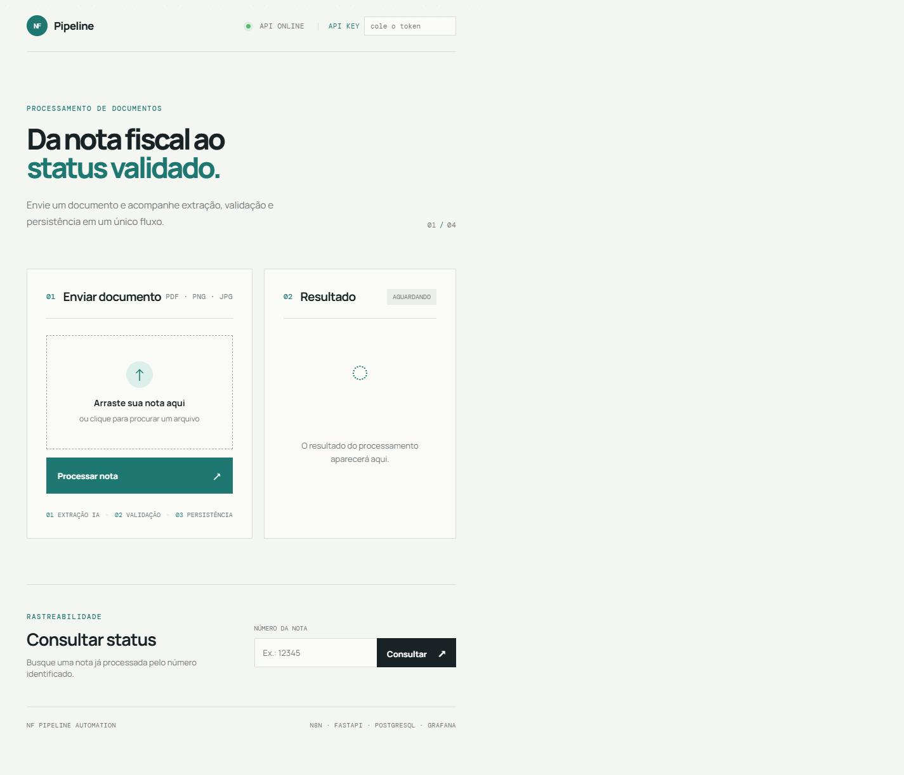

# NF Pipeline Automation

Pipeline de automação para processamento de notas fiscais: recebimento, extração de dados via IA, validação de regras de negócio, persistência em banco, consulta de status e monitoramento operacional.

O projeto também inclui uma interface web em `http://localhost:8000` para demonstrar o pipeline sem depender de comandos: basta enviar uma nota fiscal, acompanhar as etapas e consultar o status de uma nota processada.

## Arquitetura

O **n8n** orquestra o fluxo do início ao fim. O serviço em **Python (FastAPI)** entra como microsserviço de apoio, chamado via HTTP, responsável por duas coisas isoladas de propósito:

- **Extração** (`/extract-base64`, usado pelo n8n; `/extract` para upload direto): usa a API do Gemini para ler o documento e extrair os campos da nota
- **Validação** (`/validate`): aplica regras de negócio puras (CNPJ, valor, data, duplicidade), sem depender de IA

Separar extração de validação foi uma decisão deliberada: o provedor de IA pode mudar ou falhar, mas a lógica de negócio não deve depender disso.

```
Webhook → Preparar Arquivo (base64) → HTTP Request (/extract-base64) → Validar Regras de Negócio (/validate) → IF (nota válida?)
                                                                                                                ├─ true  → Postgres: grava nota aprovada
                                                                                                                └─ false → Postgres: grava nota rejeitada (com motivo)
                                                                                                                                ↓
                                                                                                                      Responde Webhook
```

O nó **Preparar Arquivo (base64)** não chama IA: ele apenas lê o arquivo recebido no webhook e o converte para base64. A extração acontece uma única vez, no nó **HTTP Request**.

Cada nota rejeitada é gravada no banco (não apenas notificada por e-mail), com:
- valores de fallback nas colunas obrigatórias quando a IA não consegue extrair um campo (nota inválida/ilegível)
- `numero_nota` único por execução, evitando colisão de constraint quando múltiplas notas inválidas caem no mesmo fallback
- `motivo_rejeicao` preenchido com a razão da rejeição

## Stack

- **n8n**: orquestração do fluxo
- **Python / FastAPI**: extração (Gemini) e validação de regras de negócio
- **Interface web**: upload de nota, acompanhamento das etapas e consulta de status
- **PostgreSQL**: persistência de notas aprovadas e rejeitadas
- **Grafana**: dashboard provisionado automaticamente com métricas operacionais e gasto vs. orçamento por etapa da obra
- **Docker Compose**: sobe os 4 serviços (n8n, Postgres, extraction_service e Grafana) de uma vez

## Estrutura

```
nf-pipeline-automation/
├── docker-compose.yml
├── .env.example
├── db/
│   ├── init.sql                # cria as tabelas automaticamente em instalações novas
│   └── migracao_obras.sql      # migração idempotente para bancos existentes
├── extraction_service/
│   ├── main.py                 # extração, validação e resumo de custos
│   ├── classificador.py        # classificação de notas por palavras-chave
│   ├── frontend/               # tela web de upload e status
│   ├── requirements.txt
│   ├── Dockerfile
│   └── tests/                  # testes automatizados
├── grafana/
│   ├── dashboards/nf-pipeline.json
│   └── provisioning/           # datasource e dashboard automáticos
└── n8n/
    └── workflow.json           # fluxo completo pronto pra importar
```

## Interface de demonstração

A interface web coloca o pipeline em primeiro plano para quem está conhecendo o projeto: o visitante pode enviar uma nota fiscal, acompanhar as etapas de extração, validação e persistência e consultar o status de uma nota já processada, sem precisar começar pelo terminal.



Ela é servida pelo próprio FastAPI em `http://localhost:8000`, reaproveitando o endpoint `/process` do fluxo principal.

## Controle de custos de obra

O pipeline também demonstra o acompanhamento de custos de uma única obra fictícia: **Casa 60m2 (simulada)**. A obra e as notas deste cenário são dados simulados, não representam uma obra ou compras reais. Os orçamentos por etapa usam preços de referência do SINAPI, e a distribuição desses valores entre as etapas é estimada para fins de demonstração; não substitui orçamento profissional nem consulta à tabela oficial vigente.

A extração inclui `descricao_itens`. Um classificador por palavras-chave atribui a nota a uma etapa; notas aprovadas recebem `obra_id` e `etapa_id`. O endpoint `GET /obras/1/resumo` apresenta, por etapa, o orçamento planejado, o gasto aprovado, a razão gasto/orçamento e um alerta quando essa razão chega a `0.9` (90%). Notas aprovadas sem etapa ficam no campo `sem_classificacao`, separadas das etapas orçadas. O dashboard provisionado do Grafana também compara gasto aprovado e orçamento diretamente no Postgres.

### Aplicar a migração em um banco existente

Em instalações novas, `db/init.sql` cria o esquema e os dados iniciais quando o volume do Postgres é inicializado pela primeira vez. Para atualizar um banco existente sem apagar dados, execute o comando abaixo no PowerShell, a partir da raiz do repositório:

```powershell
Get-Content -Raw .\db\migracao_obras.sql | docker compose exec -T postgres psql -U nf_user -d nf_pipeline -v ON_ERROR_STOP=1
```

A migração é idempotente e pode ser reaplicada. Não use `docker compose down -v`: isso apagaria os volumes do Postgres e do n8n.

### Limitações do controle de custos

- A etapa é inferida por palavras-chave da descrição e pode ficar sem classificação ou ser classificada incorretamente.
- A classificação é feita por nota, não por item; uma nota com itens de etapas diferentes recebe apenas uma etapa prioritária.
- O projeto contém uma única obra simulada e não oferece interface para corrigir manualmente a etapa ou o orçamento.

## Como rodar

1. Gere uma chave gratuita da API do Gemini em https://aistudio.google.com/app/apikey
2. Copie `.env.example` para `.env`, cole a chave do Gemini e substitua `API_AUTH_TOKEN` por um token forte. Gere um token com:
   ```bash
   python -c "import secrets; print(secrets.token_urlsafe(32))"
   ```
   Opcionalmente, defina `GEMINI_MODEL` para trocar o modelo sem alterar o código (padrão: `gemini-flash-latest`).
3. Suba os containers:
   ```bash
   docker compose up -d --build
   ```
4. Abra `http://localhost:8000` para usar a interface web de upload e acompanhar o processamento.
5. Acesse `http://localhost:5678`, importe `n8n/workflow.json` e configure **duas credenciais** (credenciais não vão dentro do arquivo exportado). Ao atualizar uma instalação existente, desative o workflow antigo antes de importar a versão atualizada:
   - **Postgres**: host `postgres`, database `nf_pipeline`, user `nf_user`
   - **Header Auth** (usada pelo nó HTTP Request): nome do header `X-API-Key` e, como valor, o `API_AUTH_TOKEN` do seu `.env`
   - Reconecte a credencial Postgres nos dois nós de gravação; eles usam SQL parametrizado para incluir obra e etapa.
6. Salve e publique/ative o workflow. Para testar, use uma nota simulada por tentativa, pois a cota do Gemini é limitada:
   ```bash
   curl -X POST http://localhost:5678/webhook/nota-fiscal -F "data=@caminho/para/nota.png"
   ```
7. Confira o resultado direto no banco:
   ```bash
   docker compose exec postgres psql -U nf_user -d nf_pipeline -c "SELECT * FROM notas_fiscais ORDER BY id DESC;"
   ```

Também é possível testar a extração e validação isoladamente, sem o n8n:
```bash
curl -X POST http://localhost:8000/process -H "X-API-Key: SEU_API_AUTH_TOKEN" -F "file=@caminho/para/nota.png"
```

### Alterando o `.env`

Variáveis de ambiente são lidas apenas quando o container é criado. Depois de alterar o `.env` (por exemplo, `API_AUTH_TOKEN`), recrie os serviços, senão n8n e FastAPI podem ficar com valores diferentes e a API responderá `401`:

```bash
docker compose up -d --force-recreate n8n extraction_service
```

Evite `docker compose down -v`: o `-v` apaga os volumes, incluindo os workflows do n8n e os dados do Postgres.

### Autenticação da API

Os endpoints de negócio (`/extract`, `/extract-base64`, `/validate`, `/process` e `/notas/{numero_nota}/status`) exigem o header `X-API-Key`. O token é carregado por variável de ambiente e não fica salvo no código, no workflow ou no README. O endpoint `/health` permanece público para probes de disponibilidade.

Os endpoints que podem chamar o Gemini (`/extract`, `/extract-base64` e `/process`) também possuem rate limiting por API key. O padrão é **10 chamadas a cada 60 segundos**; ao exceder o limite, a API responde `429 Too Many Requests` com o header `Retry-After`. Ajuste `RATE_LIMIT_REQUESTS` e `RATE_LIMIT_WINDOW_SECONDS` no `.env` conforme sua cota.

O contador é thread-safe e fica em memória no container do FastAPI, adequado para esta implantação com um serviço. Em uma implantação com múltiplas réplicas, use um armazenamento compartilhado como Redis ou um rate limiter no proxy para manter um limite global.

Na interface web, informe o mesmo token no campo **API key**. Ele fica somente no `sessionStorage` da aba e é enviado automaticamente nas ações de upload e consulta.

No workflow do n8n, o nó HTTP Request usa a credencial Header Auth, e o nó Code **Validar Regras de Negócio** lê `API_AUTH_TOKEN` do ambiente do n8n (repassado pelo Compose). Ao importar o workflow em outra instalação, configure a credencial e confirme que a variável chegou ao container do n8n.

### Resiliência da chamada ao Gemini

A chamada ao Gemini roda fora do loop de eventos (`asyncio.to_thread`) e com política explícita de falhas:

| Situação | Comportamento |
|---|---|
| Timeout | Prazo total de 50 s; tentativas limitadas a 20 s e retries consomem o mesmo prazo; responde `504` |
| `503` (alta demanda do Gemini) | Até 2 novas tentativas, com espera de 2 s e 4 s; se esgotar, responde `502` |
| `429` (cota esgotada) | Sem retry, para não gastar cota à toa; responde `502` |
| Outros erros da API ou de rede | Sem retry; responde `502` |

O timeout do nó HTTP Request no n8n está em 60 s. O modelo é configurável por `GEMINI_MODEL`.

### Interface web

A tela inicial é servida pelo próprio FastAPI e oferece:

- upload por clique ou arrastar e soltar de PDF e imagens;
- indicação visual das etapas de extração, validação e persistência;
- resultado com status, número, CNPJ, valor e data extraídos;
- feedback de erro ou rejeição com o motivo da regra de negócio;
- consulta de status por número da nota.

Ela usa o endpoint `/process` existente, portanto a demonstração visual percorre exatamente o mesmo pipeline do backend.

### Consulta de status

Depois que uma nota for processada, consulte o status pelo número da nota:

```bash
curl http://localhost:8000/notas/12345/status -H "X-API-Key: SEU_API_AUTH_TOKEN"
```

O endpoint retorna `200` com os dados principais, o status (`aprovada` ou `rejeitada`) e o motivo da rejeição, quando houver. Para uma nota inexistente, retorna `404`. Rejeições também podem ser consultadas pelo número original encontrado pela IA; o identificador `REJEITADA-*` é usado internamente para garantir unicidade no banco.

### Dashboard Grafana

Acesse `http://localhost:3000` após subir o Compose. O login inicial é `admin` / `admin123` (credencial de demonstração local; altere antes de expor o Grafana fora da sua máquina). O dashboard **NF Pipeline - Operacao** é criado automaticamente e apresenta:

- total de notas processadas;
- total de notas aprovadas;
- total de notas rejeitadas;
- processamento por dia;
- ranking dos motivos de rejeição;
- gasto aprovado versus orçamento planejado por etapa da obra simulada.

O resumo também está disponível pela API autenticada:

```bash
curl http://localhost:8000/obras/1/resumo -H "X-API-Key: SEU_API_AUTH_TOKEN"
```

## Regras de negócio implementadas

Em `extraction_service/main.py`, função `validar_dados`:

- CNPJ inválido: validação real dos dígitos verificadores, não só formato (`cnpj_e_valido`)
- Valor zero ou negativo
- Data de emissão no futuro
- Nota duplicada: consulta ao Postgres (`nota_ja_existe`)

## Testes automatizados

Os testes ficam em `extraction_service/tests/` e cobrem:

- validação real de CNPJ, incluindo dígitos verificadores;
- rejeição de número ausente, CNPJ inválido, valor inválido e data inválida;
- data futura;
- nota duplicada;
- aprovação de nota válida;
- fallback de rejeição com campos obrigatórios e número único;
- autenticação por API key e rate limiting;
- classificação integrada à validação e gravação dos IDs de obra/etapa;
- cálculo do resumo de custos, alertas, notas sem classificação e proteção do endpoint.

Para executar localmente com as dependências instaladas:

```bash
cd extraction_service
pytest -q
```

Ou usando a mesma imagem do ambiente:

```bash
docker compose run --rm extraction_service pytest -q
```

O `test_eval.py` é ignorado com um motivo explícito se a pasta `eval/` não estiver disponível dentro da imagem. Para executar também os testes de avaliação, monte essa pasta como somente leitura:

```powershell
docker compose run --rm -v "${PWD}/eval:/eval:ro" extraction_service pytest -q
```

Resultado atual: **65 testes passando**. Os testes não chamam o Gemini real, portanto não consomem cota nem precisam de chave.

Os testes automatizados não substituem a validação de integração. Depois de aplicar a migração e configurar as credenciais, teste o fluxo ponta a ponta no n8n com uma nota simulada por tentativa e confira a etapa gravada no Postgres.

## CI/CD com GitHub Actions

O workflow em `.github/workflows/ci.yml` roda automaticamente em todo `push` e `pull request` direcionado à branch `main`. Ele possui dois jobs independentes:

- **Python tests**: configura Python 3.12, instala `extraction_service/requirements.txt` e executa `pytest -q` dentro de `extraction_service`;
- **Validate Docker Compose**: executa `docker compose config` usando valores placeholder, sem precisar de chaves reais.

Os testes atuais não precisam de secrets porque não chamam o Gemini. Se forem adicionados testes de integração que usem serviços reais, configure os secrets pela interface do GitHub em **Settings → Secrets and variables → Actions → New repository secret**:

- `GEMINI_API_KEY`;
- `API_AUTH_TOKEN`.

No workflow, esses valores devem ser referenciados por `${{ secrets.GEMINI_API_KEY }}` e `${{ secrets.API_AUTH_TOKEN }}`. Nunca coloque os valores diretamente no YAML, código, README ou logs.

## Segurança

O arquivo `.env` contém `GEMINI_API_KEY` e `API_AUTH_TOKEN` e é ignorado pelo Git. O `.gitignore` bloqueia `.env` e variantes como `.env.local` e `.env.production`, liberando apenas `.env.example`, que contém somente placeholders. O Compose exige `API_AUTH_TOKEN` e falha antes de iniciar se ele não estiver configurado. Nunca coloque chaves reais no README, no workflow, no screenshot ou em arquivos versionados.

## Limitações conhecidas e próximos passos

- `gemini-flash-latest` é um alias que pode mudar de comportamento sem aviso; para uma avaliação reproduzível, fixar um modelo específico via `GEMINI_MODEL`.
- A cota gratuita do Gemini limita o volume de testes reais e de avaliação em lote.
- O projeto usa o SDK `google-generativeai`; avaliar a migração para o SDK atual do Google.
- A chamada ao Gemini tem prazo total de 50 s, menor que os 60 s do n8n; retries e esperas consomem desse mesmo prazo.
- Parametrizar a senha do Grafana por variável de ambiente.